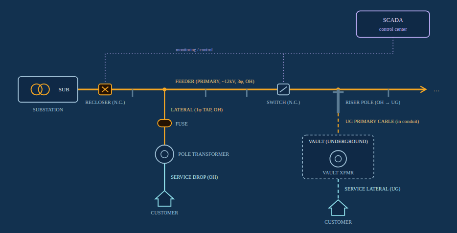

# Electric Distribution Trainer

> **This project has moved.** It is now chapter 2, *Distribution*, of the [Grid Field Guide](https://github.com/franklan-pm/grid-field-guide), live at **https://franklan.net/apps/02-distribution/**. This repo is archived, and its old web address forwards there. The text below describes the original version.

**Live site:** https://franklan-pm.github.io/electric-distribution-trainer/

The Electric Distribution Trainer is an interactive field guide to the equipment that carries power from a substation to a customer's meter. It's written for program managers and other non-engineers who work around distribution infrastructure and need to speak the language: what a feeder, lateral, recloser, riser pole, or vault actually is, how the pieces fit together, and why each one matters when you're planning or funding a project. Everything runs in a single HTML file with no install, no build step, and no dependencies. Open it in a browser and go.

The guide centers on a clickable one-line diagram (above) that follows two paths from the same feeder: an overhead path through a fused lateral and pole transformer to a service drop, and an underground path down a riser pole to a vault transformer and service lateral. The diagram uses one consistent rule: color shows voltage (orange for primary at about 12kV, blue for secondary at 120/240V), and line style shows placement (solid for overhead, dashed for underground). Click any symbol to see what it does. From there, the other tabs build on it: a glossary, flashcards, a quiz, a circuit-ordering game, a reliability calculator for SAIDI/SAIFI/CAIDI, and planning-level equipment costs.

The Playground tab puts it into motion. It's a two-feeder network joined by a normally-open tie, where you can insert a fault, watch the recloser or fuse respond, then open switches and close the tie to isolate the problem and restore as many customers as you can. It models real constraints, such as switches not being able to interrupt fault current and the hazard of closing a tie into a live fault. This is a learning tool, not an engineering reference: the voltages, costs, and device behavior are simplified and typical, so check with your utility's engineering team before relying on any number for a real decision.
